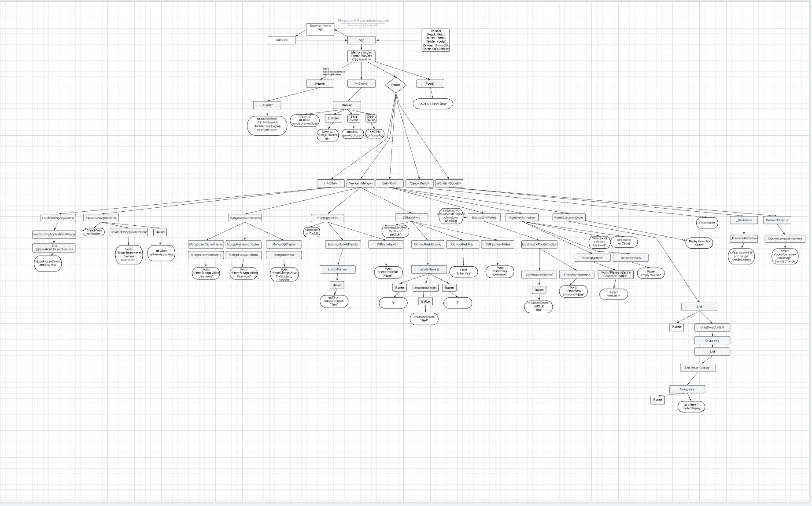

# Phlappjack

[](https://github.com/mandarineorg/leaf)


The tastiest way to build your stack... in Deno Deploy!

**No installation required**

Head to www.phlappjack.com to download the executable for your OS.

---

## Description

A GUI that provides middleware and back-end configuration to your existing front-end. Allows for rapid configuration of Oak/Mongo. Completed configuration can be exported to your local machine for further editing, turned into microservices with Docker Swarm or delivered to Deno Deploy CDN for an instantly live public app.

## Usage

To use simply:

1. Download the executable and run it.
2. Phlappjack will open your Chrome browser on http://localhost:8000
3. Create a new application, or retrieve a previously saved one.
4. Hit `SAVE`.
5. `EXPORT` will dump the files to your local system.
6. The `DEPLOY` button in Deno Deploy will push your app to you linked repository and to your project on Deno Deploy.
   

*Your configuration will be output alongside the application in the `/createdApplication` directory.*

## Development

The frontend is developed in Node and is using Webpack dev server to make the deployment process as quick and painless as possible. To work on the front end run the below:

### Frontend dev (Node)

```shell 
npm install
npm run dev
```

### Running the server in Deno

```shell
deno run --unstable --allow-read --allow-write --allow-net mod.ts
```

Optionally run with the `--watch` flag for file reloading.

This will serve the static react content stored in `/build` and watch for file changes.

### Creating a client Bundle

Any changes to the frontend will need to be re-built to be reflected in the app.

```shell
npm run build
```
### Compiling the app executable

We are using Leaf by [Mandarine](https://deno.land/x/mandarinets) in order to package our bundle files inside the binary. In order to do this you can build an executable using the below:

```shell
deno run --unstable --allow-read --allow-write --allow-net leaf.ts <optional output filename>
```

## Docker and Compose

You can run the deployment using `docker-compose up` **BUT** you need to build
the phlappjack react image first using `docker build -t phlappjack .`

## Mongo

There is now a .env file to support connecting to Mongo. Please add a .env file
to the root of the repo and populate the fields, e.g:

.env
```shell
MONGO_HOST=cluster0.yybae.mongodb.net
MONGO_DB=phlappjack
MONGO_USER=dbUser
MONGO_PASS=secret123
```

The connection uri is already set up in `server/models/`

## Dependencies

Server Dependencies are stored in `deps.ts`

Client Dependencies are stored in `package.json` and `node_modules`


## Oak Server

The backend is running Oak and serving static files from the build directory.


## Frontend component architecture

To aid development, the application structure looks like this:




## Questions
For questions & community support, please visit our [Discord Channel](https://discord.gg/phlappjack) or join us on our [twitter](https://twitter.com/phlappjack).

## Want to help?
### Interested in coding
In order to submit improvements to the code, open a PR and wait for it to review. We appreciate you doing this.
### Not interested in coding
We would love to have you in our community, [please submit an issue](https://github.com/oslabs-beta/phlappjack/issues) to provide information about a bug, feature, or improvement you would like.

## Follow us wherever we are going
- Author : [Kellen Levy Chris Salisbury Andrew Sheehy Jin Qin](https://twitter.com/phlappjack)
- Website : https://www.phlappjack.com/
- Twitter : [twitter](https://twitter.com/phlappjack)
- Discord : [Click here](https://discord.gg/phlappjack)